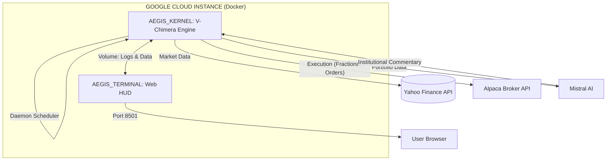
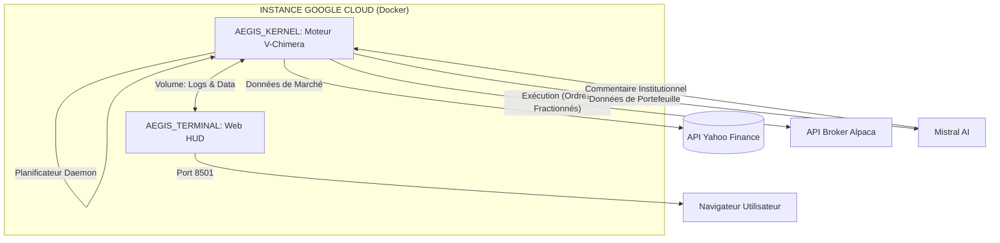

# 📈 Pollux Quantitative Macro (Aegis Prime: V-Chimera System)

**Dashboard :** [http://34.16.10.127:8501/](http://34.16.10.127:8501/)

This is an autonomous, containerized quantitative trading system deployed on Google Cloud. The **V-Chimera Engine** manages an institutional-grade "Global Macro" portfolio (Equities, Tech, Commodities, Bonds) using a deterministic mathematical engine coupled with dynamic macroeconomic data analysis. 
 
**Mistral AI** is integrated strictly as a post-execution reporting analyst to translate complex algorithmic rotations into human-readable institutional commentary.

> **“Sovereign execution. Kinetic risk management. Absolute quantitative transparency.”**

---

## 📊 Backtested Performance (2008–2026 Institutional Audit)

The V-Chimera strategy was rigorously stress-tested on real historical data spanning multiple major market crises (2008 Financial Crisis, 2020 COVID Crash, 2022 Inflationary Bear Market). Results are aligned with official trading days and include a strict **15 bps (0.15%) friction cost** per trade to simulate realistic slippage.

### 🏆 Performance Dashboard (Base 15bps)

| Metric | Pollux Quant (V-Chimera) | Benchmark (SPY) | Differential |
| :--- | :--- | :--- | :--- |
| **Final Capital (Init: $10k)** | **$139,083** | $37,170 | **+ $101,913** |
| **CAGR (Annualized)** | **32.57%** | 15.10% | **+ 17.47%** |
| **Max Drawdown** | **-19.91%** | -23.93% | **+ 4.02%** *(Superior protection)* |
| **Sharpe Ratio** | **1.37** | 0.98 | **+ 0.39** |
| **Sortino Ratio** | **2.88** | 1.42 | **+ 1.46** |
| **Annualized Volatility** | **23.81%** | 15.33% | **+ 8.48%** *(Actively scaled)* |

The **Sortino ratio of 2.88** combined with a strictly contained drawdown demonstrates the system's structural integrity: it violently captures upside momentum while utilizing a dynamic "Kinetic Brake" to lock down capital during market crashes—all while operating with **strict zero-leverage constraints**.

---

## 🧠 Quantitative Architecture (V-Chimera Engine)

The algorithm makes no predictions. It reacts to the actual state of the market by applying a strict, emotionless, five-step logic.

### 1. The Regime Sentinel (Two-Speed Hysteresis)
Capital preservation is the absolute priority. The system continuously monitors the structural integrity of the S&P 500 against its 200-day and 50-day Simple Moving Averages, alongside a 60-day drawdown tracker. If a systemic breakdown is detected, the engine enters **Bunker Mode**.

### 2. The Inflation Sentinel
During Bunker Mode, the system must decide *where* to hide. It analyzes the broader commodity market (DBC) to determine the macroeconomic nature of the crisis:
* **Deflationary Crisis (e.g., 2008, 2020):** Heavy allocation to Long-Term Treasuries (TLT), which surge as central banks cut rates.
* **Inflationary Shock (e.g., 2022):** Treasuries are abandoned. Capital rotates heavily into Gold (GLD), Commodities (DBC), and Short-Term Cash (SHY).

### 3. Adaptive Volatility & The Kinetic Brake
When the market is in a confirmed uptrend, the system scales its offensive exposure dynamically.
* **Volatility Cap:** The historical percentile rank of the SPY's 21-day volatility scales the maximum offensive budget (from 97% down to 30%). 
* **The Kinetic Brake:** A severe live-failsafe. If the live equity curve suffers an intra-strategy drawdown greater than 10%, the system unilaterally slashes offensive exposure by 50% (and 80% if drawdown >15%) to stop the bleeding, forcing capital into defensive yields.

### 4. Alpha Selection (Score-Convex Rank)
When permitted to attack, the Growth Engine scans the offensive universe (Tech, Healthcare, Alpha proxies).
* **Trend Quality Filter ($R^2$):** Demands clean, straight-line historical price action.
* **Dual Momentum:** Requires positive returns across both 6-month and 12-month timeframes.
* **Convex Allocation:** Capital is distributed among the top 7 assets using a convex blend: 60% based on their rank conviction, and 40% smoothed by Inverse Volatility Risk Parity.

### 🛡️ 5. Institutional Risk Constraints
The system applies asymmetrical constraints to mathematically prevent catastrophic wipeouts.
* **Sector & Asset Caps:** Maximum 28% exposure per single sector, and maximum 12% per single asset.
* **Zero-Leverage Protocol:** Gross exposure is mathematically hard-capped at **98%** (maintaining a permanent 2% cash buffer). The system is physically incapable of facing a margin call.

---

## 🚀 Kernel Engineering

The system solves critical real-time financial engineering challenges:
* **⚖️ Zero-Leverage Enforcement:** Built-in safeguards reject any target allocation exceeding 1.0.
* **⏱️ Daemon Scheduler:** Runs autonomously in the background, executing precise rebalancing sequences every Friday at 15:45 EST (right before market close).
* **🔪 Fractional Quantum Execution:** Routes "Notional" (USD-based) orders via the Alpaca API to execute portfolio rebalancing down to fractional shares with surgical precision, utilizing a 4% drift tolerance threshold to avoid unnecessary friction costs.
* **📡 AI-Powered Post-Trade Reporting:** Mistral AI intervenes *only after* execution to analyze the structural shift and generate a concise institutional summary.

---

## 🖥️ Command Center (Quantitative Terminal)

The Streamlit web interface acts as a personal Bloomberg Terminal, running in parallel with the trading kernel.

| Feature | Description |
| :--- | :--- |
| **Live HUD** | Real-time Net Liquidity, P&L, and Cash Reserves metrics. |
| **Monte Carlo Forecast** | Stochastic engine generating 100 future paths over 1 year based on V-Chimera audited metrics. |
| **Global Radar** | Live quantitative ranking of all assets in the universe. |
| **Deep Dive Intelligence** | Integrated, interactive TradingView charts for detailed technical review. |

---

## 🏗️ Technical Architecture



---

## 🛠️ Deployment (Zero-Touch)

The infrastructure is designed for immediate, isolated cloud deployment via Docker Compose.

```bash
# 1. Clone the Repository
git clone [https://github.com/Polluxgnr/aegis_prime.git](https://github.com/Polluxgnr/aegis_prime.git)
cd aegis_prime

# 2. Environment Setup (.env)
echo "ALPACA_API_KEY=your_key" >> .env
echo "ALPACA_SECRET_KEY=your_secret" >> .env
echo "ALPACA_BASE_URL=[https://paper-api.alpaca.markets](https://paper-api.alpaca.markets)" >> .env
echo "MISTRAL_API_KEY=your_mistral_key" >> .env

# 3. Ignite the Fleet
sudo docker-compose up -d --build

# 4. Monitoring
# Terminal: http://YOUR_SERVER_IP:8501
# Live logs: sudo docker logs -f aegis_kernel

```

***© 2026 Pollux Quantitative Research.***

---

---

# 🇫🇷 VERSION FRANÇAISE

# 📈 Pollux Quantitative Macro (Système Aegis Prime : V-Chimera)

**Dashboard :** [http://34.16.10.127:8501/](http://34.16.10.127:8501/)

Il s'agit d'un système de trading quantitatif autonome, conteneurisé et déployé sur Google Cloud. Le moteur **V-Chimera** gère un portefeuille "Global Macro" de niveau institutionnel (Actions, Tech, Matières premières, Obligations) en utilisant un moteur mathématique déterministe couplé à une analyse dynamique des données macroéconomiques en temps réel.

**Mistral AI** est intégré strictement en tant qu'analyste de reporting post-exécution pour traduire les rotations algorithmiques complexes en commentaires institutionnels clairs.

> **"Exécution souveraine. Gestion cinétique du risque. Transparence quantitative absolue."**

---

## 📊 Performance Backtestée (Audit Institutionnel 2008-2026)

La stratégie V-Chimera a été rigoureusement soumise à des tests de résistance sur des données historiques réelles couvrant plusieurs crises majeures (Crise financière de 2008, Krach COVID de 2020, Marché baissier inflationniste de 2022). Les résultats sont alignés sur les jours de bourse officiels et incluent un **coût de friction strict de 15 bps (0,15 %)** par transaction pour simuler un slippage réaliste.

### 🏆 Tableau de Bord des Performances (Base 15bps)

| Métrique | Pollux Quant (V-Chimera) | Benchmark (SPY) | Différentiel |
| --- | --- | --- | --- |
| **Capital Final (Init: 10k$)** | **139 083 $** | 37 170 $ | **+ 101 913 $** |
| **CAGR (Annuel)** | **32,57 %** | 15,10 % | **+ 17,47 %** |
| **Max Drawdown** | **-19,91 %** | -23,93 % | **+ 4,02 %** *(Protection supérieure)* |
| **Ratio de Sharpe** | **1,37** | 0,98 | **+ 0,39** |
| **Ratio de Sortino** | **2,88** | 1,42 | **+ 1,46** |
| **Volatilité Annualisée** | **23,81 %** | 15,33 % | **+ 8,48 %** *(Gérée activement)* |

Le ratio de **Sortino de 2,88** combiné à un drawdown strictement contenu démontre l'intégrité structurelle du système : il capture violemment les phases de hausse du momentum tout en utilisant un "Frein Cinétique" dynamique pour verrouiller le capital lors des krachs boursiers, le tout en opérant avec **des contraintes strictes de zéro levier**.

---

## 🧠 Architecture Quantitative (Moteur V-Chimera)

L'algorithme ne fait aucune prédiction. Il réagit à l'état réel du marché en appliquant une logique stricte et dénuée d'émotions en cinq étapes.

### 1. La Sentinelle de Régime (Hystérésis à Deux Vitesses)

La préservation du capital est la priorité absolue. Le système surveille en permanence l'intégrité structurelle du S&P 500 par rapport à ses moyennes mobiles simples à 200 jours et 50 jours, ainsi qu'un traqueur de drawdown sur 60 jours. Si une rupture systémique est détectée, le moteur entre en **Bunker Mode**.

### 2. La Sentinelle d'Inflation

Pendant le Bunker Mode, le système doit décider *où* se cacher. Il analyse le marché des matières premières (DBC) pour déterminer la nature macroéconomique de la crise :

* **Crise Déflationniste (ex: 2008, 2020) :** Allocation massive aux obligations à long terme (TLT), qui explosent lorsque les banques centrales baissent les taux.
* **Choc Inflationniste (ex: 2022) :** Les obligations sont abandonnées. Le capital pivote massivement vers l'Or (GLD), les Matières Premières (DBC) et le Cash à court terme (SHY).

### 3. Volatilité Adaptative & Frein Cinétique

Lorsque le marché est dans une tendance haussière confirmée, le système ajuste dynamiquement son exposition offensive.

* **Plafond de Volatilité :** Le rang centile historique de la volatilité à 21 jours du SPY ajuste le budget offensif maximum (de 97 % jusqu'à 30 %).
* **Le Frein Cinétique (Kinetic Brake) :** Une sécurité sévère en direct. Si la courbe de capital en direct subit un drawdown intra-stratégie supérieur à 10 %, le système ampute unilatéralement l'exposition offensive de 50 % (et de 80 % si le drawdown >15 %) pour stopper l'hémorragie, forçant le capital vers des rendements défensifs.

### 4. Sélection d'Alpha (Classement Convexe)

Lorsqu'il est autorisé à attaquer, le moteur de croissance scanne l'univers offensif (Tech, Santé, Proxys Alpha).

* **Filtre de Qualité de Tendance () :** Exige une action des prix historique propre et en ligne droite.
* **Double Momentum :** Nécessite des rendements positifs sur les périodes de 6 mois et 12 mois.
* **Allocation Convexe :** Le capital est distribué parmi les 7 meilleurs actifs en utilisant un mélange convexe : 60 % basé sur leur rang de conviction, et 40 % lissé par la Parité des Risques par Volatilité Inverse.

### 🛡️ 5. Contraintes de Risque Institutionnelles

Le système applique des contraintes asymétriques pour prévenir mathématiquement les anéantissements catastrophiques.

* **Plafonds Sectoriels & d'Actifs :** Exposition maximale de 28 % par secteur unique, et maximale de 12 % par actif unique.
* **Protocole Zéro Levier :** L'exposition brute est mathématiquement plafonnée à **98 %** (maintenant un tampon de liquidité permanent de 2 %). Le système est physiquement incapable de subir un appel de marge.

---

## 🚀 Ingénierie du Kernel

Le système résout des défis critiques d'ingénierie financière en temps réel :

* **⚖️ Application du Zéro-Levier :** Des sécurités intégrées rejettent toute allocation cible dépassant 1.0.
* **⏱️ Planificateur Daemon :** Fonctionne de manière autonome en arrière-plan, exécutant des séquences de rééquilibrage précises tous les vendredis à 15h45 EST (juste avant la clôture du marché).
* **🔪 Exécution Fractionnée Quantique :** Route des ordres "Notionnels" (basés sur l'USD) via l'API Alpaca pour exécuter le rééquilibrage du portefeuille jusqu'aux fractions d'actions avec une précision chirurgicale, en utilisant un seuil de tolérance de dérive de 4 % pour éviter les coûts de friction inutiles.
* **📡 Reporting IA Post-Trade :** Mistral AI intervient *uniquement après* l'exécution pour analyser le changement structurel et générer un résumé institutionnel concis.

---

## 🖥️ Command Center (Terminal Quantitatif)

L'interface web Streamlit agit comme un Terminal Bloomberg personnel, fonctionnant en parallèle du noyau de trading.

| Fonctionnalité | Description |
| --- | --- |
| **HUD en Direct** | Métriques en temps réel de la Liquidité Nette, du P&L et des Réserves de Cash. |
| **Prévisions Monte Carlo** | Moteur stochastique générant 100 trajectoires futures sur 1 an basées sur les métriques auditées de V-Chimera. |
| **Radar Global** | Classement quantitatif en direct de tous les actifs de l'univers. |
| **Deep Dive Intelligence** | Graphiques TradingView interactifs intégrés pour une revue technique détaillée. |

---

## 🏗️ Architecture Technique



---

## 🛠️ Déploiement (Zero-Touch)

L'infrastructure est conçue pour un déploiement cloud immédiat et isolé via Docker Compose.

```bash
# 1. Cloner le Dépôt
git clone [https://github.com/Polluxgnr/aegis_prime.git](https://github.com/Polluxgnr/aegis_prime.git)
cd aegis_prime

# 2. Configuration de l'Environnement (.env)
echo "ALPACA_API_KEY=votre_cle" >> .env
echo "ALPACA_SECRET_KEY=votre_secret" >> .env
echo "ALPACA_BASE_URL=[https://paper-api.alpaca.markets](https://paper-api.alpaca.markets)" >> .env
echo "MISTRAL_API_KEY=votre_cle_mistral" >> .env

# 3. Lancement de la Flotte
sudo docker-compose up -d --build

# 4. Monitoring
# Terminal : http://VOTRE_IP_SERVEUR:8501
# Logs en direct : sudo docker logs -f aegis_kernel

```

***© 2026 Pollux Quantitative Research.***

```

```
