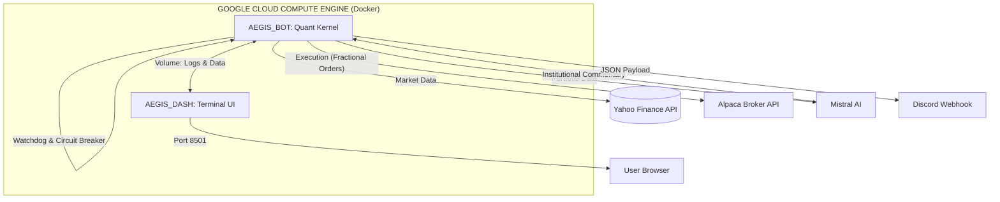

# 🛡️ Autonomous AI-Driven Hedge Fund 

C'est un système de trading quantitatif, conteneurisé et déployé sur Google Cloud. Il gère un portefeuille "Global Macro" (Tech, Crypto, Matières premières, Obligations) en utilisant un moteur mathématique déterministe couplé à une analyse de données macroéconomiques en temps réel. **Mistral AI** est utilisé exclusivement comme analyste de reporting pour vulgariser les décisions algorithmiques.

> **"Sovereign execution. Quantitative transparency. Global reach."**

---

## 📈 Performance Backtestée (Audit 2016-2026)

La stratégie a été éprouvée sur 10 ans de données historiques réelles, en incluant les coûts de transaction (slippage/commissions) et l'impact de marché.

### 🏆 Tableau de Bord Institutionnel

| Métrique | AEGIS PRIME (VF) | Benchmark (SPY) | Différentiel |
| --- | --- | --- | --- |
| **Capital Final (Init: 10k)** | **$159,827** | $36,647 | **+ $123,180** |
| **CAGR (Annuel)** | **33.43%** | 14.47% | **+ 18.96%** |
| **Max Drawdown** | **-28.86%** | -31.83% | **+ 2.97%** (Moins de perte) |
| **Sharpe Ratio** | **1.37** | 0.84 | **+ 0.53** |
| **Sortino Ratio** | **2.31** | 1.04 | **+ 1.27** |
| **Volatilité Annualisée** | **24.37%** | 17.18% | + 7.19% |

Le ratio de Sortino (2.31) démontre que bien que la stratégie soit plus volatile que le marché, cette volatilité s'exprime de manière asymétrique : elle capture violemment les hausses tout en verrouillant fermement les baisses.

---

## 🧠 La Stratégie Expliquée (Adaptive Volatility & Decoupled Risk)

L'algorithme ne fait pas de prédictions. Il réagit à ce qui se passe *réellement* sur le marché en appliquant une logique en 3 étapes de manière stricte et sans émotions.

### 1. Le Filtre Macro ("Bunker Mode")

La première question que se pose le bot est : *Le marché global est-il en train de s'effondrer ?*
Pour y répondre, il regarde le S&P 500 par rapport à sa moyenne mobile sur 200 jours (SMA 200).

* **Si le SPY est sous sa SMA 200 :** Le bot coupe immédiatement toute exposition aux actifs à risque. Il passe en "Bunker Mode" et alloue 100% du capital à des valeurs refuges (40% Or, 40% Obligations d'État à long terme, 20% Cash). Il attend que l'orage passe.
* **Si le SPY est au-dessus :** Le marché est sain, le bot passe à l'étape 2.

### 2. Le Thermomètre de Volatilité

Puisque le marché est sain, le bot mesure son niveau de nervosité (la volatilité sur 21 jours du SPY) pour décider de son agressivité :

* **Volatilité Basse (<15%) :** C'est un marché haussier calme. Le bot alloue **90%** du capital à l'attaque (Growth) et **10%** à la défense (Shield).
* **Volatilité Normale (15-25%) :** Allocation équilibrée **50/50**.
* **Volatilité Haute (>25%) :** Le marché est haussier mais erratique. Le bot réduit la voilure : **20%** attaque, **80%** défense.

### 3. La Sélection des Actifs (Dual Engine)

* **Moteur Growth (L'Attaque) :** Il scanne l'univers des actifs offensifs (Tech, Crypto) et sélectionne le Top 5 basé sur le **Momentum ajusté au risque**. Il ne choisit pas l'actif qui a le plus monté, mais celui qui a monté de la façon la plus stable (Momentum / Volatilité).
* **Moteur Shield (La Défense) :** Il sélectionne un Top 6 sectoriellement diversifié (Matières premières, Pharma, Défense) et distribue le capital selon le principe d'**Inverse Volatilité** : plus un actif est stable, plus il reçoit d'argent. Cela crée un centre de gravité lourd pour le portefeuille.

### 🛡️ Le "Decoupled Risk Management" (La Clé de la VF)

L'innovation majeure de la version finale réside dans la séparation des risques. L'algorithme limite l'exposition sectorielle (Max 25%) et par action (Max 8%) **uniquement sur les actifs d'attaque**. Cela empêche d'être surexposé à la Tech en cas de bulle. En revanche, les actifs de défense (Or, Obligations) n'ont pas de plafond, ce qui leur permet de prendre massivement le relais pour amortir les chocs boursiers.

---

## 🚀 L'Ingénierie du Kernel

Le système résout des défis critiques d'ingénierie financière en temps réel :

* **🔪 Fractional Quantum Execution :** Le moteur route des ordres "Notional" (en dollars via l'API Alpaca). Cela permet d'acheter des fractions d'actions avec une précision chirurgicale, évitant tout capital dormant.
* **⚖️ Zero-Leverage Protocol :** Audit en temps réel garantissant une exposition maximale bloquée à **98%** (2% de cash buffer permanent). Le système est mathématiquement incapable de recourir à l'effet de levier ou de subir un appel de marge.
* **🐕 Intraday Watchdog :** Un coupe-circuit autonome surveille l'équité du portefeuille en direct. Si une chute de **-10%** est détectée depuis l'ouverture (Crash Flash), le trading est gelé et une alerte rouge est émise.
* **📡 AI-Powered Reporting :** La logique de trading est 100% mathématique. Mistral AI intervient uniquement *après* l'exécution : il lit les données chiffrées et génère une synthèse institutionnelle envoyée sur Discord.

---

## 📊 Command Center (Terminal Quantitatif)

L'interface web Streamlit agit comme un Terminal Bloomberg personnel, connecté en direct au broker.

| Feature | Description |
| --- | --- |
| **Real-Time ROI** | Profit net calculé en direct depuis le dépôt initial. |
| **Institutional Metrics** | Tableau généré en temps réel affichant le Sharpe, Sortino, VaR (5%), Skewness et Kurtosis. |
| **Monte Carlo Forecast** | Modèle stochastique générant 100 scénarios futurs sur 1 an pour définir des objectifs Optimistes / Médians / Pessimistes. |
| **Global Radar** | Classement (Rank 1 à N) de tous les actifs de l'univers selon leur V3 Score (Momentum / Volatilité). |
| **Trade & P&L Analysis** | Scan des positions ouvertes pour afficher instantanément les meilleurs gains et les pires pertes en cours, couplé à l'historique brut des exécutions. |

---

## 🏗️ Architecture Technique



---

## 🛠️ Déploiement & Installation (Zero-Touch)

AEGIS est conçu pour un déploiement cloud immédiat via Docker Compose.

```bash
# 1. Clonage du Repository
git clone https://github.com/votre-username/AEGIS_PRIME.git
cd AEGIS_PRIME

# 2. Configuration (.env)
echo "ALPACA_API_KEY=your_key" >> .env
echo "ALPACA_SECRET_KEY=your_secret" >> .env
echo "ALPACA_BASE_URL=https://paper-api.alpaca.markets" >> .env
echo "MISTRAL_API_KEY=your_mistral_key" >> .env
echo "DISCORD_WEBHOOK_URL=your_webhook" >> .env

# 3. Lancement de la Flotte
sudo docker-compose up -d --build

# 4. Monitoring
# Terminal : http://YOUR_SERVER_IP:8501
# Logs en direct : sudo docker logs -f aegis_bot

```

***© 2026 Pollux CORP. Sentinel Sovereign System Operational.*** *Avis : Le trading algorithmique comporte des risques substantiels. Ce logiciel est fourni à des fins éducatives et de démonstration technologique.*

---

---

# ⬇️ ENGLISH VERSION ⬇️

# 🛡️ Autonomous AI-Driven Hedge Fund (AEGIS PRIME VF)

This is a containerized quantitative trading system deployed on Google Cloud. It manages a “Global Macro” portfolio (Tech, Crypto, Commodities, Bonds) using a deterministic mathematical engine coupled with real-time macroeconomic data analysis. **Mistral AI** is used exclusively as a reporting analyst to translate algorithmic decisions into institutional commentary.

> **“Sovereign execution. Quantitative transparency. Global reach.”**

---

## 📈 Backtested Performance (2016–2026 Audit)

The strategy was evaluated on 10 years of real historical data, factoring in transaction costs (slippage/commissions) and market impact.

### 🏆 Institutional Dashboard

| Metric | AEGIS PRIME (VF) | Benchmark (SPY) | Differential |
| --- | --- | --- | --- |
| **Final Capital (Init: 10k)** | **$159,827** | $36,647 | **+ $123,180** |
| **CAGR (Annual)** | **33.43%** | 14.47% | **+ 18.96%** |
| **Max Drawdown** | **-28.86%** | -31.83% | **+ 2.97%** (Less loss) |
| **Sharpe Ratio** | **1.37** | 0.84 | **+ 0.53** |
| **Sortino Ratio** | **2.31** | 1.04 | **+ 1.27** |
| **Annualized Volatility** | **24.37%** | 17.18% | + 7.19% |

The Sortino ratio (2.31) demonstrates that while the strategy is more volatile than the market, this volatility is highly asymmetric: it violently captures upside momentum while strictly locking down downside risk.

---

## 🧠 The Strategy Explained (Adaptive Volatility & Decoupled Risk)

The algorithm makes no predictions. It reacts to what is *actually* happening in the market by strictly applying a 3-step logic, devoid of emotion.

### 1. The Macro Filter ("Bunker Mode")

The first question the bot asks is: *Is the broader market collapsing?*
To answer this, it compares the S&P 500 to its 200-day Simple Moving Average (SMA 200).

* **If SPY is below its SMA 200:** The bot immediately cuts all exposure to risk assets. It enters "Bunker Mode", allocating 100% of the capital to safe havens (40% Gold, 40% Long-Term Treasuries, 20% Cash). It waits out the storm.
* **If SPY is above:** The market is healthy, the bot proceeds to step 2.

### 2. The Volatility Thermometer

Since the market is healthy, the bot measures its level of nervousness (21-day volatility of the SPY) to determine its aggressiveness:

* **Low Volatility (<15%):** A calm bull market. The bot allocates **90%** of capital to offense (Growth) and **10%** to defense (Shield).
* **Normal Volatility (15-25%):** A balanced **50/50** allocation.
* **High Volatility (>25%):** The market is bullish but erratic. The bot scales back: **20%** offense, **80%** defense.

### 3. Asset Selection (Dual Engine)

* **Growth Engine (The Offense):** It scans the universe of offensive assets (Tech, Crypto) and selects the Top 5 based on **Risk-Adjusted Momentum**. It doesn't pick the asset that went up the most, but the one that went up the smoothest (Momentum / Volatility).
* **Shield Engine (The Defense):** It selects a sector-diversified Top 6 (Commodities, Pharma, Defense) and distributes capital using the **Inverse Volatility** principle: the more stable an asset is, the more money it gets. This creates a heavy, stable center of gravity for the portfolio.

### 🛡️ Decoupled Risk Management (The Key to the VF)

The major innovation of the final version lies in risk separation. The algorithm limits sector exposure (Max 25%) and single-stock exposure (Max 8%) **only on attack assets**. This prevents overexposure to Tech during a bubble. However, defense assets (Gold, Bonds) have no cap, allowing them to massively take over and absorb shocks during market crashes.

---

## 🚀 Kernel Engineering

The system solves critical real-time financial engineering challenges:

* **🔪 Fractional Quantum Execution:** The engine routes "Notional" (USD-based) orders via the Alpaca API. This allows for the purchase of fractional shares with surgical precision, leaving no capital dormant.
* **⚖️ Zero-Leverage Protocol:** Real-time audit enforcing a maximum exposure hard-capped at **98%** (2% permanent cash buffer). The system is mathematically incapable of using leverage or facing a margin call.
* **🐕 Intraday Watchdog:** An autonomous circuit breaker monitors live portfolio equity. If a **-10%** drop from the daily open is detected (Flash Crash), trading is frozen and a red alert is issued.
* **📡 AI-Powered Reporting:** The trading logic is 100% mathematical. Mistral AI intervenes only *after* execution: it reads the hard data and generates an institutional summary sent to Discord.

---

## 📊 Command Center (Quantitative Terminal)

The Streamlit web interface acts as a personal Bloomberg Terminal, connected live to the broker.

| Feature | Description |
| --- | --- |
| **Real-Time ROI** | Net profit calculated live from the initial deposit. |
| **Institutional Metrics** | Live-generated table displaying Sharpe, Sortino, VaR (5%), Skewness, and Kurtosis. |
| **Monte Carlo Forecast** | Stochastic model generating 100 1-year future scenarios to define Optimistic / Median / Pessimistic targets. |
| **Global Radar** | Ranking (1 to N) of all assets in the universe based on their V3 Score (Momentum / Volatility). |
| **Trade & P&L Analysis** | Scans open positions to instantly display the best active wins and worst active losses, paired with a raw execution history log. |

---

## 🏗️ Technical Architecture


---

## 🛠️ Deployment & Installation (Zero-Touch)

AEGIS is designed for immediate cloud deployment via Docker Compose.

```bash
# 1. Clone the Repository
git clone https://github.com/your-username/AEGIS_PRIME.git
cd AEGIS_PRIME

# 2. Configuration (.env)
echo "ALPACA_API_KEY=your_key" >> .env
echo "ALPACA_SECRET_KEY=your_secret" >> .env
echo "ALPACA_BASE_URL=https://paper-api.alpaca.markets" >> .env
echo "MISTRAL_API_KEY=your_mistral_key" >> .env
echo "DISCORD_WEBHOOK_URL=your_webhook" >> .env

# 3. Launch the Fleet
sudo docker-compose up -d --build

# 4. Monitoring
# Terminal: http://YOUR_SERVER_IP:8501
# Live logs: sudo docker logs -f aegis_bot

```

***© 2026 Pollux CORP. Sentinel Sovereign System Operational.*** *Disclaimer: Algorithmic trading involves substantial risk.
This software is provided for educational and technological demonstration purposes only.*
