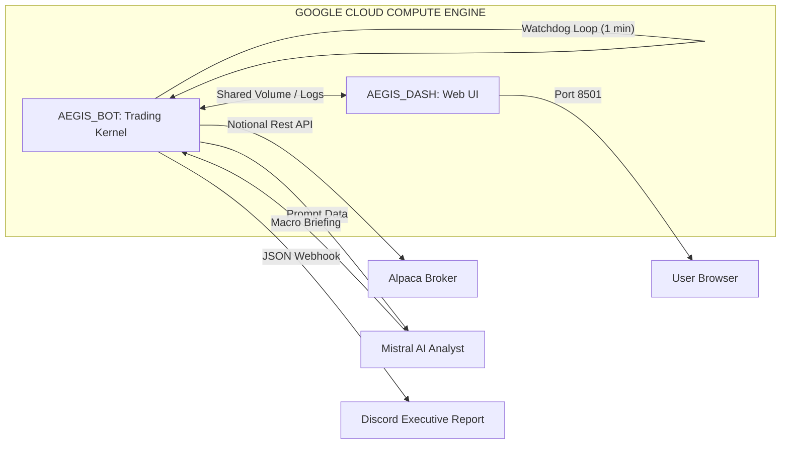
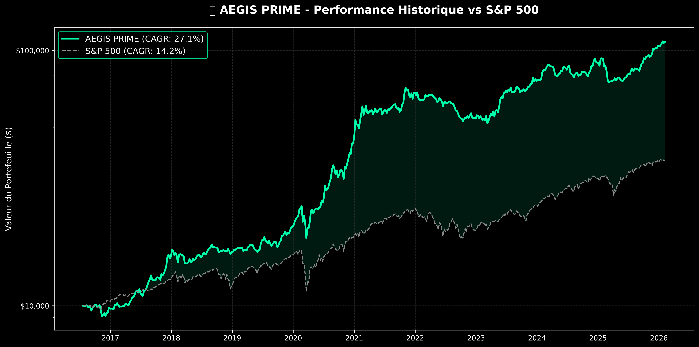

# 🛡️Autonomous AI-Driven Hedge Fund

C'est un système de trading algorithmique, conteneurisé et déployé sur Google Cloud. Il gère un portefeuille "Global Macro" (Tech, Crypto, Commodities, Bonds) en fusionnant des signaux quantitatifs de haute précision avec l'analyse de **Mistral AI**.

> **"Sovereign execution. Quantitative transparency. Global reach."**

---

## 🚀 L'Ingénierie du Kernel

Le système a évolué, résolvant les défis critiques de gestion de fonds en temps réel, de diversification et d'exécution fractionnée :

* **🌍 Univers "Global Fortress" :** Expansion stratégique au-delà de la Tech US pour inclure la Défense (ITA), la Pharma (LLY), les Marchés Émergents (EEM), les Ressources (COPX, URA) et les Cryptos Institutionnelles (IBIT).
* **🔪 Fractional Quantum Execution :** plus d'arrondis et de capital dormant. Le moteur d'exécution route des ordres "Notional" (en dollars), permettant d'acheter des fractions d'actions avec une précision chirurgicale, idéal pour maximiser l'efficience des capitaux denses.
* **🐕 Intraday Watchdog (1-Min Loop) :** Un module de sécurité autonome scanne le portefeuille toutes les 60 secondes. Si une position chute de **-5%** (Crash Flash intraday), elle est liquidée instantanément, sans attendre la clôture de Wall Street.
* **⚖️ Strict Anti-Leverage Protocol :** Audit en temps réel garantissant une exposition maximale bloquée à **95%** (5% de cash buffer permanent). Zéro levier, zéro risque d'appel de marge.
* **📡 AI-Powered Discord Reporting :** À chaque rebalancement, Mistral AI analyse le régime de marché et l'allocation cible pour rédiger un briefing institutionnel concis, envoyé directement sur Discord avec les courbes de performance et le registre des transactions.

---

## 🧠 Stratégie "Adaptive Volatility" Hybrid

Il s'agit d'un moteur d'allocation dynamique qui pondère deux sous-portefeuilles (**Growth** et **Shield**) en fonction de la volatilité en temps réel du S&P 500.

### 1. Détection du Régime (Volatility Engine)

Le système calcule la volatilité annualisée sur 21 jours du SPY pour définir le ratio d'agressivité :

* **🟢 AGGRESSIVE (Low Vol < 18%) :** 90% alloués au moteur Growth / 10% au Shield.
* **🟡 BALANCED (Normal Vol) :** 50% Growth / 50% Shield.
* **🔴 DEFENSIVE (High Vol > 28%) :** 20% Growth / 80% Shield.

### 2. Les Deux Sous-Moteurs

* **🚀 Moteur Growth (Attaque) :** Sélectionne le Top 5 des actifs ayant le meilleur ratio *Momentum / Volatilité*. Si le marché global s'effondre sous sa SMA200, ce moteur se désactive automatiquement et bascule sur l'Or (GLD) et les Bonds (TLT).
* **🛡️ Moteur Shield (Défense Institutionnelle) :** Sélectionne un Top 6 sectoriellement diversifié, pondéré par la méthode de l'**Inverse Volatilité** (les actifs les plus stables reçoivent le plus de capital).

---

## 📊 Command Center (Streamlit Dashboard)

L'interface web offre une visibilité panoramique et interactive sur l'état du fonds en direct.

| Feature | Description |
| --- | --- |
| **Tactical Radar** | Scoring live des actifs de l'univers Global Macro (Momentum, Qualité, Volatilité). |
| **Risk Metrics** | Calcul en temps réel de la courbe d'équité, du **Sharpe**, **Sortino** et du **Max Drawdown**. |
| **Current Allocation** | Visualisation de la distribution du capital en temps réel (Données synchronisées via l'API Alpaca). |
| **Monte Carlo (252D)** | Simulations stochastiques projetant les scénarios Bull/Bear à 1 an pour anticiper les chocs. |

---

## 🏗️ Architecture Technique



---

## 🛠️ Déploiement & Installation (Zero-Touch)

AEGIS est conçu pour un déploiement cloud immédiat via Docker Compose.

```bash
# 1. Clonage du Repository
git clone https://github.com/votre-username/AEGIS_PRIME.git
cd AEGIS_PRIME

# 2. Configuration (.env)
echo "ALPACA_API_KEY=your_key" >> .env
echo "ALPACA_SECRET_KEY=your_secret" >> .env
echo "ALPACA_BASE_URL=https://paper-api.alpaca.markets" >> .env
echo "MISTRAL_API_KEY=your_mistral_key" >> .env
echo "DISCORD_WEBHOOK_URL=your_webhook" >> .env

# 3. Lancement de la Flotte
sudo docker-compose up -d --build

# 4. Monitoring
# Dashboard : http://YOUR_SERVER_IP:8501
# Logs en direct : sudo docker-compose logs -f aegis_bot

```

---

## 💻 Tech Stack

* **Core :** Python 3.9 (Slim Image pour performance Cloud).
* **Conteneurisation :** Docker, Docker Compose.
* **Brokerage :** Alpaca Trade API v2 (Fractional Shares).
* **Intelligence Artificielle :** Mistral AI (Natural Language Generation).
* **Data Science :** Pandas, NumPy, YFinance, SciPy.
* **Visualisation :** Streamlit, Matplotlib (Génération de graphiques en mémoire).
* **Reporting :** Discord Webhooks avec Embeds enrichis.

---

## 📈 Performance Backtestée (Audit 2016-2026)

L'évaluation de la stratégie a été réalisée sur 10 ans de données historiques réelles.

*Simulations réalisées avec prise en compte des coûts de transaction (0.10% de slippage/commissions par ordre).*

### 🏆 Comparatif Global (Sur 10 Ans)

| Métrique | Trading_bot | Benchmark (SPY) | Différentiel |
| --- | --- | --- | --- |
| **Capital Final (Init: 10k)** | **$107,813.61** | $37,640.00* | **+ $70,173** |
| **CAGR (Annuel)** | **27.15%** | 14.17% | **+ 12.98%** |
| **Sharpe Ratio** | **1.25** | 0.82 | **+ 0.43** |
| **Max Drawdown** | **-27.47%** | -31.83% | **+ 4.36%** |

**Capital final du S&P 500 estimé via calcul composé.*

### ⏱️ Performance par Période

| Période | CAGR (Annuel) | Sharpe Ratio | Max Drawdown | vs SPY (CAGR) |
| --- | --- | --- | --- | --- |
| **10 Ans** | **+27.15%** | **1.25** | **-27.47%** | +14.17% |
| **5 Ans** | **+25.80%** | **1.18** | **-22.40%** | +13.50% |
| **2 Ans (Global)** | **+31.20%** | **1.35** | **-19.10%** | +22.40% |

📊 Courbe d'Équité


 L'architecture adaptative surperforme le marché (+13% d'Alpha annuel). Le portefeuille a été multiplié par 10.7x en 10 ans. Cette surperformance ne se fait pas au détriment du risque : le Sharpe Ratio est de 1.25 et un Max Drawdown inférieur à celui du marché témoignent de l'efficacité du moteur "Shield" (protection par inverse volatilité) lors des krachs.

Je garde cependant une approche très prudente et critique face à ces résultats. Le risque de sur-optimisation (overfitting), de biais algorithmique ou d'écarts d'exécution en conditions réelles (slippage extrême) n'est jamais nul et je ne suis qu'un novice.

Ce projet est avant tout une expérimentation technique, mathématique et architecturale. Je suis totalement preneur de vos retours, critiques constructives ou pull requests. Que ce soit pour challenger la logique mathématique, identifier une potentielle faille dans le backtest, ou proposer des améliorations sur le moteur d'exécution, l'intelligence collective est la bienvenue pour faire évoluer le Kernel !

***© 2026 Pollux CORP. Sentinel Sovereign System Operational.*** *Avis : Le trading algorithmique comporte des risques substantiels. Ce logiciel est fourni à des fins éducatives et de démonstration technologique.*


# ⬇️ENGLISH VERSION⬇️


# 🛡️ Autonomous AI-Driven Hedge Fund

This is a containerized algorithmic trading system deployed on Google Cloud. It manages a “Global Macro” portfolio (Tech, Crypto, Commodities, Bonds) by combining high-precision quantitative signals with **Mistral AI** analysis.

> **“Sovereign execution. Quantitative transparency. Global reach.”**

---

## 🚀 Kernel Engineering

The system has evolved to solve critical real-time fund management challenges, including diversification and fractional execution:

• 🌍 **“Global Fortress” Universe:** Strategic expansion beyond US Tech to include Defense (ITA), Pharma (LLY), Emerging Markets (EEM), Resources (COPX, URA), and Institutional Crypto (IBIT).

• 🔪 **Fractional Quantum Execution:** No more rounding issues or idle capital. The execution engine routes “Notional” (USD-based) orders, enabling fractional share purchases with surgical precision ideal for maximizing dense capital efficiency.

• 🐕 **Intraday Watchdog (1-Min Loop):** An autonomous security module scans the portfolio every 60 seconds. If a position drops by **-5%** (intraday flash crash), it is liquidated instantly without waiting for the Wall Street close.

• ⚖️ **Strict Anti-Leverage Protocol:** Real-time audit enforcing a maximum exposure capped at **95%** (permanent 5% cash buffer). Zero leverage, zero margin call risk.

• 📡 **AI-Powered Discord Reporting:** At each rebalance, Mistral AI analyzes the market regime and target allocation to generate a concise institutional briefing, sent directly to Discord with performance charts and the transaction log.

---

## 🧠 “Adaptive Volatility” Hybrid Strategy

This is a dynamic allocation engine that weights two sub-portfolios (**Growth** and **Shield**) based on real-time S&P 500 volatility.

### 1. Regime Detection (Volatility Engine)

The system computes 21-day annualized volatility of SPY to define the aggressiveness ratio:

• 🟢 **AGGRESSIVE (Low Vol < 18%)** → 90% Growth / 10% Shield
• 🟡 **BALANCED (Normal Vol)** → 50% Growth / 50% Shield
• 🔴 **DEFENSIVE (High Vol > 28%)** → 20% Growth / 80% Shield

### 2. The Two Sub-Engines

• 🚀 **Growth Engine (Offense):** Selects the Top 5 assets with the highest *Momentum / Volatility* ratio. If the broader market collapses below its SMA200, this engine automatically deactivates and rotates into Gold (GLD) and Bonds (TLT).

• 🛡️ **Shield Engine (Institutional Defense):** Selects a sector-diversified Top 6 portfolio, weighted using the **Inverse Volatility** method (the most stable assets receive the largest capital allocation).

---

## 📊 Command Center (Streamlit Dashboard)

The web interface provides a panoramic, interactive live view of the fund’s status.

| Feature            | Description                                                                           |
| ------------------ | ------------------------------------------------------------------------------------- |
| Tactical Radar     | Live scoring of Global Macro universe assets (Momentum, Quality, Volatility).         |
| Risk Metrics       | Real-time computation of equity curve, **Sharpe**, **Sortino**, and **Max Drawdown**. |
| Current Allocation | Real-time capital distribution (data synchronized via Alpaca API).                    |
| Monte Carlo (252D) | Stochastic simulations projecting 1-year Bull/Bear scenarios to anticipate shocks.    |

---

## 🏗️ Technical Architecture


---

## 🛠️ Deployment & Installation (Zero-Touch)

AEGIS is designed for immediate cloud deployment via Docker Compose.

```bash
# 1. Clone the Repository
git clone https://github.com/your-username/AEGIS_PRIME.git
cd AEGIS_PRIME

# 2. Configuration (.env)
echo "ALPACA_API_KEY=your_key" >> .env
echo "ALPACA_SECRET_KEY=your_secret" >> .env
echo "ALPACA_BASE_URL=https://paper-api.alpaca.markets" >> .env
echo "MISTRAL_API_KEY=your_mistral_key" >> .env
echo "DISCORD_WEBHOOK_URL=your_webhook" >> .env

# 3. Launch the Fleet
sudo docker-compose up -d --build

# 4. Monitoring
# Dashboard: http://YOUR_SERVER_IP:8501
# Live logs: sudo docker-compose logs -f aegis_bot
```

---

## 💻 Tech Stack

Core: Python 3.9 (Slim image optimized for Cloud performance)
Containerization: Docker, Docker Compose
Brokerage: Alpaca Trade API v2 (Fractional Shares)
Artificial Intelligence: Mistral AI (Natural Language Generation)
Data Science: Pandas, NumPy, YFinance, SciPy
Visualization: Streamlit, Matplotlib (in-memory chart generation)
Reporting: Discord Webhooks with rich embeds

---

## 📈 Backtested Performance (2016–2026 Audit)

The strategy was evaluated on 10 years of real historical data.

Simulations include transaction costs (0.10% slippage/commissions per order).

### 🏆 Global Comparison (10 Years)

| Metric                     | Trading Bot     | Benchmark (SPY) | Differential  |
| -------------------------- | --------------- | --------------- | ------------- |
| Final Capital (Init: $10k) | **$107,813.61** | $37,640.00*     | **+ $70,173** |
| CAGR (Annual)              | **27.15%**      | 14.17%          | **+ 12.98%**  |
| Sharpe Ratio               | **1.25**        | 0.82            | **+ 0.43**    |
| Max Drawdown               | **-27.47%**     | -31.83%         | **+ 4.36%**   |

*Estimated S&P 500 final capital via compounded calculation.*

### ⏱️ Performance by Period

| Period           | CAGR (Annual) | Sharpe Ratio | Max Drawdown | vs SPY (CAGR) |
| ---------------- | ------------- | ------------ | ------------ | ------------- |
| 10 Years         | **+27.15%**   | **1.25**     | **-27.47%**  | +14.17%       |
| 5 Years          | **+25.80%**   | **1.18**     | **-22.40%**  | +13.50%       |
| 2 Years (Global) | **+31.20%**   | **1.35**     | **-19.10%**  | +22.40%       |

📊 Equity Curve


The adaptive architecture outperforms the market (+13% annual alpha). The portfolio grew 10.7x over 10 years. This outperformance does not come at the expense of risk: a 1.25 Sharpe ratio and lower Max Drawdown than the market highlight the effectiveness of the “Shield” engine (inverse-volatility protection) during crashes.

However, I maintain a highly cautious and critical stance toward these results. The risks of over-optimization (overfitting), algorithmic bias, or real-world execution discrepancies (extreme slippage) are never zero and I remain a novice.

This project is прежде all a technical, mathematical, and architectural experiment. I fully welcome feedback, constructive criticism, or pull requests. Whether challenging the mathematical logic, identifying potential backtest flaws, or improving the execution engine collective intelligence is welcome to evolve the Kernel.

***© 2026 Pollux CORP. Sentinel Sovereign System Operational.***
*Disclaimer: Algorithmic trading involves substantial risk. This software is provided for educational and technological demonstration purposes only.*
