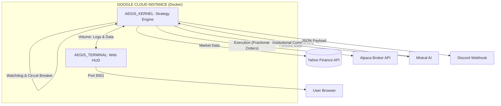

# 📈 Pollux Quantitative Macro (Aegis Prime System)

This is an autonomous, containerized quantitative trading system deployed on Google Cloud. It manages a “Global Macro” portfolio (Equities, Tech, Commodities, Bonds) using a deterministic mathematical engine coupled with real time macroeconomic data analysis. 
 
**Mistral AI** is integrated strictly as a post-execution reporting analyst to translate algorithmic decisions into human readable institutional commentary.

> **“Sovereign execution. Quantitative transparency. Global reach.”**

---

## 📊 Backtested Performance (2016–2026 Institutional Audit)

The strategy was rigorously evaluated on real historical data, strictly aligned with official NYSE trading days (~252 days/year), factoring in transaction costs (10 bps slippage/commissions).

### 🏆 Performance Dashboard

| Metric | Pollux Quant | Benchmark (SPY) | Differential |
| :--- | :--- | :--- | :--- |
| **Final Capital (Init: 10k)** | **$75,848** | $37,018 | **+ $38,830** |
| **CAGR (Annualized)** | **25.03%** | 15.52% | **+ 9.51%** |
| **Max Drawdown** | **-26.72%** | -31.83% | **+ 5.11%** *(Less loss)* |
| **Sharpe Ratio** | **1.54** | 0.86 | **+ 0.68** |
| **Sortino Ratio** | **2.23** | 1.08 | **+ 1.15** |
| **Annualized Volatility** | **16.29%** | 17.97% | **- 1.68%** *(More stable)* |

The **Sortino ratio of 2.23** demonstrates the system's perfect asymmetry: it violently captures upside momentum while strictly locking down capital during market crashes, all while operating with **zero leverage**.

---

## 🧠 Quantitative Architecture

The algorithm makes no predictions. It reacts to the actual state of the market by applying a strict, emotionless 3 step logic.

### 1. The Macro Filter ("Bunker Mode")
The first question the system asks is: *Is the broader market collapsing?*
It continuously monitors the S&P 500 against its 200 day Simple Moving Average (SMA 200).
* **If SPY < SMA 200:** The system cuts all equity exposure. It enters "Bunker Mode", allocating 100% of capital to safe havens (Gold, Long Term Treasuries, Cash).
* **If SPY > SMA 200:** The market is deemed healthy, the system proceeds to asset selection.

### 2. The Volatility Thermometer
The engine measures market nervousness (21 day volatility of the SPY) to define its strategic allocation:
* **Low Volatility (<15%):** Calm bull market. **90%** Offense / **10%** Defense.
* **Normal Volatility (15-25%):** Uncertain market. **50%** Offense / **50%** Defense.
* **High Volatility (>25%):** Erratic market. **20%** Offense / **80%** Defense.

### 3. Asset Selection (Dual Engine)
* **Growth Engine (Offense):** Scans the offensive universe (Tech, Global Equities, Crypto Proxies) and selects the Top 5 assets based on **Risk Adjusted Momentum**. It favors assets that rise steadily (Momentum / Volatility). Internal weighting is dictated by Inverse Volatility Risk Parity.
* **Shield Engine (Defense):** Maintains a heavy, stable center of gravity for the portfolio via Gold and US Treasuries.

### 🛡️ Decoupled Risk Management (The Key Innovation)
The major breakthrough of this architecture lies in risk separation. The algorithm dynamically limits exposure (Max 25% per sector, Max 8% per single stock) **only on offensive assets**. This inherently prevents overexposure to isolated sector bubbles. Conversely, defense assets have no cap, allowing them to massively absorb shocks when needed.

---

## 🚀 Kernel Engineering

The system solves critical real-time financial engineering challenges:
* **⚖️ Zero-Leverage Protocol:** A real-time audit enforces a maximum gross exposure hard-capped at **98%** (2% permanent cash buffer). The system is mathematically incapable of facing a margin call.
* **🐕 Intraday Watchdog:** An autonomous circuit breaker. If a **-10%** equity drop from the daily open is detected (Flash Crash scenario), trading is frozen and a red alert is issued.
* **🔪 Fractional Quantum Execution:** The engine routes "Notional" (USD-based) orders via the Alpaca API to execute portfolio rebalancing down to fractional shares with surgical precision.
* **📡 AI-Powered Post-Trade Reporting:** The trading logic is 100% mathematical. Mistral AI intervenes *only after* execution to analyze the structural shift and generate a concise institutional summary sent via Discord webhook.

---

## 🖥️ Command Center (Quantitative Terminal)

The Streamlit web interface acts as a personal Bloomberg Terminal, running in parallel with the trading kernel.

| Feature | Description |
| :--- | :--- |
| **Live HUD** | Real-time Net Liquidity, P&L, and Cash Reserves metrics. |
| **Monte Carlo Forecast** | Stochastic engine generating 100 future paths over 1 year to define Optimistic, Median, and Pessimistic portfolio targets. |
| **Global Radar** | Live quantitative ranking of all assets in the universe based on their V3 Score. |
| **Deep Dive Intelligence** | Integrated, interactive TradingView charts for detailed technical review of targeted assets. |

---

## 🏗️ Technical Architecture



---

## 🛠️ Deployment (Zero-Touch)

The infrastructure is designed for immediate, isolated cloud deployment via Docker Compose.

```bash
# 1. Clone the Repository
git clone [https://github.com/Polluxgnr/aegis_prime.git](https://github.com/Polluxgnr/aegis_prime.git)
cd aegis_prime

# 2. Environment Setup (.env)
echo "ALPACA_API_KEY=your_key" >> .env
echo "ALPACA_SECRET_KEY=your_secret" >> .env
echo "ALPACA_BASE_URL=[https://paper-api.alpaca.markets](https://paper-api.alpaca.markets)" >> .env
echo "MISTRAL_API_KEY=your_mistral_key" >> .env
echo "DISCORD_WEBHOOK_URL=your_webhook" >> .env

# 3. Ignite the Fleet
sudo docker-compose up -d --build

# 4. Monitoring
# Terminal: http://YOUR_SERVER_IP:8501
# Live logs: sudo docker logs -f aegis_kernel

```

***© 2026 Pollux Quantitative Research.***

---

---

# 🇫🇷 VERSION FRANÇAISE

# 📈 Pollux Quantitative Macro (Aegis Prime System)

Il s'agit d'un système de trading quantitatif autonome, conteneurisé et déployé sur Google Cloud. Il gère un portefeuille "Global Macro" (Actions, Tech, Matières premières, Obligations) en utilisant un moteur mathématique déterministe couplé à une analyse des données macroéconomiques en temps réel.

**Mistral AI** est intégré strictement en tant qu'analyste de reporting post-exécution pour vulgariser les décisions de l'algorithme.

> **"Exécution souveraine. Transparence quantitative. Portée globale."**

---

## 📊 Performance Backtestée (Audit Institutionnel 2016-2026)

La stratégie a été rigoureusement évaluée sur des données historiques réelles, alignées strictement sur les jours d'ouverture officiels du NYSE (~252 jours/an), en incluant les coûts de transaction (10 bps de slippage/commissions).

### 🏆 Tableau de Bord des Performances

| Métrique | Pollux Quant | Benchmark (SPY) | Différentiel |
| --- | --- | --- | --- |
| **Capital Final (Init: 10k)** | **$75,848** | $37,018 | **+ $38,830** |
| **CAGR (Annuel)** | **25.03%** | 15.52% | **+ 9.51%** |
| **Max Drawdown** | **-26.72%** | -31.83% | **+ 5.11%** *(Moins de pertes)* |
| **Sharpe Ratio** | **1.54** | 0.86 | **+ 0.68** |
| **Sortino Ratio** | **2.23** | 1.08 | **+ 1.15** |
| **Volatilité Annualisée** | **16.29%** | 17.97% | **- 1.68%** *(Plus stable)* |

Le ratio de **Sortino de 2.23** démontre l'asymétrie parfaite du système : il capture violemment les hausses tout en verrouillant fermement le capital lors des krachs boursiers, le tout en opérant avec **zéro effet de levier**.

---

## 🧠 Architecture Quantitative

L'algorithme ne fait aucune prédiction. Il réagit à l'état réel du marché en appliquant une logique stricte et dénuée d'émotions en 3 étapes.

### 1. Le Filtre Macro ("Bunker Mode")

La première question que se pose le système est : *Le marché global est-il en train de s'effondrer ?*
Il scrute en permanence le S&P 500 par rapport à sa moyenne mobile sur 200 jours (SMA 200).

* **Si le SPY < SMA 200 :** Le système coupe toute exposition aux actions. Il passe en "Bunker Mode" et alloue 100% du capital aux valeurs refuges (Or, Obligations à long terme, Cash).
* **Si le SPY > SMA 200 :** Le marché est jugé sain, le système passe à la sélection d'actifs.

### 2. Le Thermomètre de Volatilité

Le moteur mesure le niveau de nervosité du marché (volatilité du SPY sur 21 jours) pour définir son allocation stratégique :

* **Volatilité Basse (<15%) :** Marché haussier calme. **90%** Attaque / **10%** Défense.
* **Volatilité Normale (15-25%) :** Marché incertain. **50%** Attaque / **50%** Défense.
* **Volatilité Haute (>25%) :** Marché erratique. **20%** Attaque / **80%** Défense.

### 3. La Sélection des Actifs (Dual Engine)

* **Growth Engine (L'Attaque) :** Scanne l'univers offensif (Tech, Actions Globales, Proxys Crypto) et sélectionne le Top 5 basé sur le **Momentum ajusté au risque**. Il privilégie les actifs qui montent de façon stable (Momentum / Volatilité). L'allocation interne est dictée par la Parité des Risques (Inverse Volatilité).
* **Shield Engine (La Défense) :** Maintient un centre de gravité lourd et stable pour le portefeuille via l'Or et les Bons du Trésor US.

### 🛡️ Le "Decoupled Risk Management" (L'Innovation Clé)

L'avancée majeure de cette architecture réside dans la séparation des risques. L'algorithme limite dynamiquement l'exposition (Max 25% par secteur, Max 8% par action) **uniquement sur les actifs offensifs**. Cela empêche intrinsèquement toute surexposition à une bulle sectorielle. À l'inverse, les actifs de défense n'ont aucun plafond, ce qui leur permet d'absorber massivement les chocs lorsque nécessaire.

---

## 🚀 L'Ingénierie du Kernel

Le système résout des défis d'ingénierie financière critiques en temps réel :

* **⚖️ Protocol Zéro-Levier :** Un audit en temps réel garantit une exposition brute maximale bloquée à **98%** (buffer cash permanent de 2%). Le système est mathématiquement incapable de subir un appel de marge.
* **🐕 Watchdog Intraday :** Un coupe-circuit autonome. Si une chute de **-10%** de l'équité est détectée depuis l'ouverture (scénario de Flash Crash), le trading est gelé et une alerte rouge est émise.
* **🔪 Exécution Fractionnée (Quantum) :** Le moteur route des ordres "Notionnels" (basés sur le dollar) via l'API Alpaca pour exécuter le rebalancement du portefeuille jusqu'à la fraction d'action avec une précision chirurgicale.
* **📡 Reporting IA Post-Trade :** La logique de trading est 100% mathématique. Mistral AI intervient *uniquement après* l'exécution pour analyser le changement structurel et générer un résumé institutionnel envoyé via un webhook Discord.

---

## 🖥️ Command Center (Terminal Quantitatif)

L'interface web Streamlit agit comme un Terminal Bloomberg personnel, tournant en parallèle du noyau de trading.

| Fonctionnalité | Description |
| --- | --- |
| **HUD en Direct** | Métriques en temps réel de la liquidité nette, du P&L et des réserves de cash. |
| **Prévisions Monte Carlo** | Moteur stochastique générant 100 trajectoires futures sur 1 an pour définir des cibles de portefeuille Optimistes, Médianes et Pessimistes. |
| **Radar Global** | Classement quantitatif en direct de tous les actifs de l'univers basé sur leur Score V3. |
| **Deep Dive Intelligence** | Graphiques TradingView interactifs intégrés pour une revue technique détaillée des actifs ciblés. |

---

## 🏗️ Architecture Technique


---

## 🛠️ Déploiement (Zero-Touch)

L'infrastructure est conçue pour un déploiement cloud immédiat et isolé via Docker Compose.

```bash
# 1. Cloner le Dépôt
git clone [https://github.com/Polluxgnr/aegis_prime.git](https://github.com/Polluxgnr/aegis_prime.git)
cd aegis_prime

# 2. Configuration de l'Environnement (.env)
echo "ALPACA_API_KEY=your_key" >> .env
echo "ALPACA_SECRET_KEY=your_secret" >> .env
echo "ALPACA_BASE_URL=[https://paper-api.alpaca.markets](https://paper-api.alpaca.markets)" >> .env
echo "MISTRAL_API_KEY=your_mistral_key" >> .env
echo "DISCORD_WEBHOOK_URL=your_webhook" >> .env

# 3. Lancement de la Flotte
sudo docker-compose up -d --build

# 4. Monitoring
# Terminal : http://VOTRE_IP_SERVEUR:8501
# Logs en direct : sudo docker logs -f aegis_kernel

```

***© 2026 Pollux Quantitative Research.***
